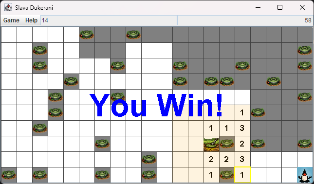

# Slava Dukerani



A Minesweeper/Sokoban cross-over game where you must find and avoid mines while pushing a sensor to clear a path to the
exit on the other side of the map. The game features procedurally generated levels, multiple difficulty settings,
Can you survive the dangers and reach the exit?

## Gameplay

Like Minesweeper, the game is played on a grid of squares, some of which contain mines. The player must use logic
and deduction to determine which squares are safe to click on and which ones contain mines.

Like Sokoban, the player can move around the grid and push the sensor to clear a path to the exit. The sensor cannot
be pulled, only pushed. The player must carefully plan their moves to avoid getting trapped or stepping on a mine.

The sensor equipment can only detect nearby mines and as such has to be pushed strategically to be effective.  The
squares within range of the sensor will display a number.  The number indicates how many mines are adjacent to that
square, similar to Minesweeper.  This information can be used to deduce the location of mines and plan the player's
moves accordingly.

Players can also flag squares they believe contain mines, which can help them keep track of potential dangers.

## Controls

- WASD/Arrow keys to move Duke.
- Q/Left click to reveal a tile.
- E/Right click to toggle a flag on a tile.

White tiles are empty.  If they have a number on them, that number indicates how many mines are adjacent to that
tile, including diagonals.  Left click on a tile adjacent to Duke to move Duke there.  You can only move to tiles
that are cardinally adjacent to Duke, not diagonally.  If you move into
the sensor tile it will attempt to push the sensor in the same direction.

Sometimes if you clear an empty tile it will also clear adjacent empty tiles, just like Minesweeper.  Press left and 
right to perform a "chord", which reveals all adjacent tiles if the number of flags around a tile matches the number
on that tile.  Pressing Q and E together will also perform a chord.

## Winning and Losing

The player wins when Duke or the sensors stands on the exit tile.  The player loses if Duke steps on a mine, if the
sensor is pushed onto a mine, or if a mine is revealed by clicking on it.  The player can also lose by getting
themselves trapped in a corner with no way to move without stepping on a mine, or by getting the sensor stuck.

## Challenge maps

Anyone can create a challenge map by creating a string with equal length lines filled with 1s and 0s, where 1s
represent mines and 0s represent empty tiles.  For example, the following is a 5x3 map.

```
00001
00101
00100
```
The string can be pasted into the game.

## Display

- `Game > Settings` menu has options to adjust the size, difficulty, and random seed of the generated levels.
- `Game > New Game` menu option starts a new game.
- `Game > Restart` repeats the current game.

The main menu bar also displays remaining flags and elapsed time.

Your avatar is randomly selected from a set of 29 different Dukes.

## Changelog

1.1 Added support for huge maps
1.2 Added Chording and pasting challenge maps